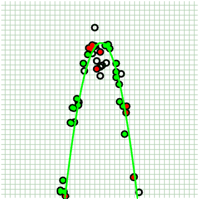

# Table of Content
- [Table of Content](#table-of-content)
- [1. My Changes](#1-my-changes)
- [2. How to Use](#2-how-to-use)
- [3. Contact](#3-contact)
- [4. Information about original repository](#4-information-about-original-repository)

# 1. My Changes
* dependents on eigen3 for fitting Ax=b
* add quadratic model (done). 
  (_green dots are inliner, red dots are curve definition points, empty dots are outliers, legends are the same for all figures_)


* add polynomial model (done)


 
* add linear least square model for over-deterministic problem (done). 
  _performance is the same with quadratic and polynomial implementation, since all used lookup table for point-to-curve distance calculation._



* polish codes (working)
* GPU support (maybe)
* add SVD for least squares (maybe)
* regularized least square (maybe)

# 2. How to Use
* openmp is required for multi-threads, see cmake file
* compile
```bash
$ mkdir build && cd build
$ cmake ..
$ make
```

* API, see examples

# 3. Contact
Autonomous Driving / Machine Learning Engineer

Author, Zhiliang Zhou, [Linkedin](https://www.linkedin.com/in/zhiliang-zhou/)


---
# 4. Information about original repository
GRANSAC: Multi-threaded generic RANSAC implemetation

Author, Srinath Sridhar (srinaths@umich.edu), Max Planck Institute for Informatics
