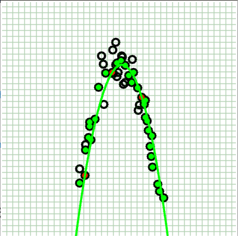
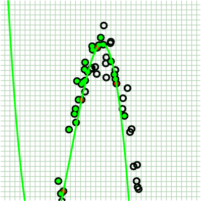

# Table of Content
- [Table of Content](#table-of-content)
- [1. My Changes](#1-my-changes)
- [2. How to Use](#2-how-to-use)
- [README from original repository](#readme-from-original-repository)
    - [GRANSAC: Multi-threaded generic RANSAC implemetation](#gransac-multi-threaded-generic-ransac-implemetation)
    - [Dependencies](#dependencies)
    - [Usage](#usage)
    - [Example: Line Fitting](#example-line-fitting)
    - [License](#license)
    - [Contact](#contact)

# 1. My Changes
* add quadratic model (done)



* add polynomial model (done)



* dependents on eigen3 for fitting Ax=b
* add general linear least square model, performance of distance calculation could be a problem (working on)
* maybe add SVD fitting in the future
* maybe add regularized least square in the future

# 2. How to Use
```bash
$ mkdir build && cd build
$ cmake ..
$ make
```

---
# README from original repository
## GRANSAC: Multi-threaded generic RANSAC implemetation

This is a header-only, multi-threaded implementation of the [RANSAC algorithm](https://en.wikipedia.org/wiki/RANSAC),
used widely in computer vision.

Unlikely most other implementations, this is a **generic** implementation
which can be adopted for any problem. The user has to implement a class that
inherits the AbstractModel class. Using RANSAC afterwards should just work.

## Dependencies

This library uses *C++11* features, so a suitable compiler is required (GCC 4.7+, 
Visual Studio 2013+). Additionally, *OpenMP* is needed for multi-threading.

Optionally, to build the line fiting example, *OpenCV* and *CMake* are required.

## Usage

Just include the header GRANSAC.hpp in your application. The AbstractModel class
needs to be inherited to implement a suitable model for your application.

## Example: Line Fitting

To demonstrate how to use the library a line fitting example is included.
To build this example do the following:

```bash
$ pwd
<SOME_DIR>/GRANSAC
$ mkdir build && cd build
$ cmake ../examples/
$ make
$ ./LineFittingSample 1000 500
```

Running LineFittingSample should display a window with random 2D points around
the diagonal. Green points show inliers.


## License

GRANSAC is released under an [MIT License](https://opensource.org/licenses/MIT).

## Contact

Srinath Sridhar (srinaths@umich.edu)
Max Planck Institute for Informatics
